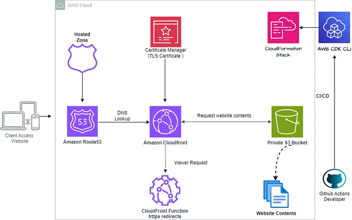

## How to deploy a static website with SSL using AWS CDK (Cloud Development Kit), CloudFront, ACM (AWS Certificate Manager), and Route 53



CloudFront is Amazon’s low-latency Content Delivery Network (CDN). Using a CDN speeds up the distribution of content to visitors by serving content from edge locations that are closest to the user.

- [@Joel O. Wembo](https://www.joelotepawembo.com)
- [@twitter](twitter.com/joelwembo1)
- [@linkedin](https://www.linkedin.com/in/joelotepawembo)


# Prerequisites:
Before we get into the good stuffs, first we need to make sure we have the required services on our local machine or dev server, which are:

- Basic knowledge of AWS CDK.
- AWS Account
- Github Account
- AWS CLI installed and configured.
- Docker installed locally.
- AWS CDK installed.
- Typescript installed
- NPM
- NodeJS
- A Domain name Hosted from any domain name provider ( Ex: AWS Route 53 )
- Basic familiarity with YAML and GitHub workflows.
- Basic knowledge of HTML or React
- Any Browser for testing
- Intermediate knowledge in Serverless Computing ( Ex : AWS Lambda , ECS,..)
- Domain name Hosted inside or outside AWS


## Initialize the project

```
cdk init app --language typescript
```

##  Main Stack
Create a file inside the lib directory cdk-route53-cloudfront-stack and paste this code

```
import * as route53 from 'aws-cdk-lib/aws-route53';
import * as s3 from 'aws-cdk-lib/aws-s3';
import * as acm from 'aws-cdk-lib/aws-certificatemanager';
import * as cloudfront from 'aws-cdk-lib/aws-cloudfront';
import * as targets from 'aws-cdk-lib/aws-route53-targets';
import * as cloudfront_origins from 'aws-cdk-lib/aws-cloudfront-origins';
import * as s3deploy from 'aws-cdk-lib/aws-s3-deployment';

import { BlockPublicAccess, BucketAccessControl } from 'aws-cdk-lib/aws-s3';

import { CfnOutput, Duration, RemovalPolicy, Stack, StackProps } from 'aws-cdk-lib';
import { Construct } from 'constructs';

export class CloudFrontRoute53Stack extends Stack {
  constructor(scope: Construct, id: string, props?: StackProps) {
    super(scope, id, props);

      const domain = 'topcommerce-app.com';
      const siteDomain = 'www' + '.' + domain;

      const zone = route53.HostedZone.fromLookup(this, 'Zone', { domainName: domain });

        const certificate = new acm.DnsValidatedCertificate(this, 'SiteCertificate', {
          domainName: domain,
          subjectAlternativeNames: ['*.' + domain],
              hostedZone: zone,
              region: 'ap-southeast-1', 
        });

        certificate.applyRemovalPolicy(RemovalPolicy.DESTROY)

        new CfnOutput(this, 'Certificate', { value: certificate.certificateArn });

        const siteBucket = new s3.Bucket(this, 'SiteBucket', {
          bucketName: siteDomain,
          publicReadAccess: true,
          removalPolicy: RemovalPolicy.DESTROY,
          autoDeleteObjects: true,
          blockPublicAccess: BlockPublicAccess.BLOCK_ACLS,
          accessControl: BucketAccessControl.BUCKET_OWNER_FULL_CONTROL,
          websiteIndexDocument: 'index.html',
          websiteErrorDocument: 'error.html'})

          new CfnOutput(this, 'Bucket', { value: siteBucket.bucketName });

        const distribution = new cloudfront.Distribution(this, 'SiteDistribution', {
          certificate: certificate,
          defaultRootObject: "index.html",
          domainNames: [siteDomain, domain],
          minimumProtocolVersion: cloudfront.SecurityPolicyProtocol.TLS_V1_2_2021,
          errorResponses:[
            {
              httpStatus: 404,
              responseHttpStatus: 404,
              responsePagePath: 'error.html',
              ttl: Duration.minutes(30),
            }
          ],
          defaultBehavior: {
            origin: new cloudfront_origins.S3Origin(siteBucket),
            compress: true,
            allowedMethods: cloudfront.AllowedMethods.ALLOW_GET_HEAD_OPTIONS,
            viewerProtocolPolicy: cloudfront.ViewerProtocolPolicy.REDIRECT_TO_HTTPS,
          }
        });

        new CfnOutput(this, 'DistributionId', { value: distribution.distributionId });

        new route53.ARecord(this, 'WWWSiteAliasRecord', {
          zone,
          recordName: siteDomain,
          target: route53.RecordTarget.fromAlias(new targets.CloudFrontTarget(distribution))
        });
        new route53.ARecord(this, 'SiteAliasRecord', {
          zone,
          recordName: domain,
          target: route53.RecordTarget.fromAlias(new targets.CloudFrontTarget(distribution))
        });

        new s3deploy.BucketDeployment(this, 'UploadWebsiteContent', {
          sources: [s3deploy.Source.asset('./website-content')],
          destinationBucket: siteBucket,
        });
  }
}
```

## Compilation Steps

1. 
```
npm install
```
2. 
```
npm run build
```
3. 
```
cdk bootstrap --trust=xxxxxxxxx aws://xxxxxxxxx/ap-southeast-1 --cloudformation-execution-policies arn:aws:iam::aws:policy/AdministratorAccess aws://xxxxxxxx/ap-southeast-1 --verbose --profile=default
```
4. 

```
cdk deploy --force --method=direct --require-approval never  --verbose --no-previous-parameters --profile=default
```

## CI/CD

Edit the file deploy.yaml inside .github/worflows folder

```
name: AWS CDK CI for CloudFront and Route53
on:
  pull_request:
    branches:
    - master

jobs:
  build:
    name: Build and Test AWS CDK Typescript Stack
    runs-on: ubuntu-latest
    steps:
      - name: Initiated By User
        run: echo $GITHUB_ACTOR

      - name: Check Out Code
        uses: actions/checkout@v3.1.0

      - name: Install Node
        uses: actions/setup-node@v3.5.0

      - name: Install Dependencies
        run: npm install aws-cdk

      - name: Install AWS-CDK
        run: npm ci  

      - name: Build CDK Stack
        run: npm run build

      - name: Deploy AWS CDK Stack
        run: "cdk deploy CloudFrontRoute53Stack --ci --require-approval never --no-asset-metadata"
        env:
          AWS_ACCESS_KEY_ID: ${{ secrets.AWS_ACCESS_KEY_ID }}
          AWS_SECRET_ACCESS_KEY: ${{ secrets.AWS_SECRET_ACCESS_KEY }}
          AWS_DEFAULT_REGION: "ap-southeast-1"   

```

Thank you for Reading !! 🙌🏻, see you in the next article.🤘

# For more information about the author visit

- [@Joel O. Wembo](https://www.joelotepawembo.com)
- [@twitter](twitter.com/joelwembo1)
- [@linkedin](https://www.linkedin.com/in/joelotepawembo)

